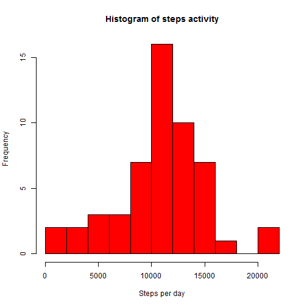
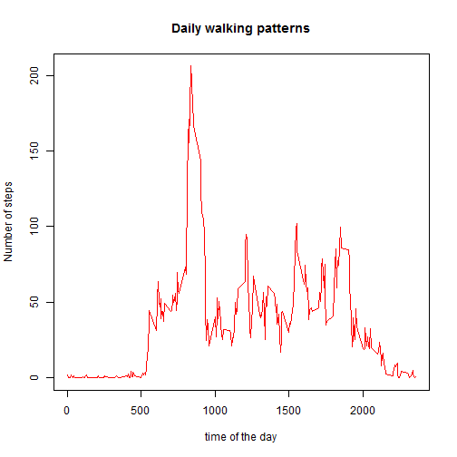
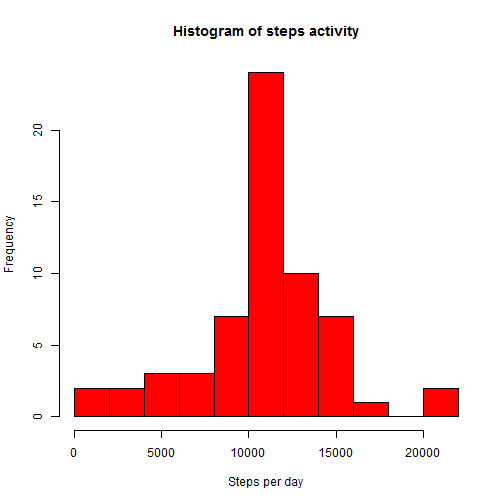

#Reproducible Research Assignment - week 2

##Loading and preprocessing the data


```r
setwd("C:\\Local\\My local Documents\\Training\\Data Analytics\\Reproducible\\assignment week2")
unzip("activity.zip")
activity<-read.csv("activity.csv",stringsAsFactors=FALSE)
```

##What is mean total number of steps taken per day?
NA values are ignored for now.

- Histogram of the total number of steps taken each day

```r
#Assuming the histogram has the other variable (interval) on the x axis. if not, it would be histogram of steps taken per day?
stepsPerDay<-aggregate(activity$steps,list(activity$date),sum)
colnames(stepsPerDay)<-c("day","totalSteps")
hist(stepsPerDay$totalSteps, col="red", xlab="Steps per day", breaks=10, main="Histogram of steps activity")
```

 

- Calculate and report the mean and median total number of steps taken per day

```r
mean(stepsPerDay$totalSteps,na.rm=TRUE)
```

```
## [1] 10766.19
```

```r
median(stepsPerDay$totalSteps,na.rm=TRUE)
```

```
## [1] 10765
```

## What is the average daily activity pattern?
- Make a time series plot of the 5-minute interval (x-axis) and the average number of steps taken, averaged across all days (y-axis)

```r
stepsPerIntvl<-aggregate(activity$steps,list(activity$interval),mean ,na.rm=TRUE)
colnames(stepsPerIntvl)<-c("interval","avgSteps")
plot(stepsPerIntvl, type="l",col="red", main="Daily walking patterns", xlab="time of the day",ylab="Number of steps")
```

 

- Which 5-minute interval, on average across all the days in the dataset, contains the maximum number of steps?

```r
index<-which.max(stepsPerIntvl$average.steps)
stepsPerIntvl[index,1]
```

```
## integer(0)
```

##Inputing missing values
- Calculate and report the total number of missing values in the dataset (i.e. the total number of rows with NAs)

```r
sum(is.na(activity$step))
```

```
## [1] 2304
```

- Devise a strategy for filling in all of the missing values in the dataset. 

**We'll replace a NA with the mean for that 5-minute interval across the other days. As full days are NA, average on a full day does not make sense (mean of NA only)**

- Create a new dataset that is equal to the original dataset but with the missing data filled in.


```r
#Merge to add mean values and order again (for readability)
activityNoNA<-merge(activity,stepsPerIntvl, by="interval")
activityNoNA<-activityNoNA[order(activityNoNA$date,activityNoNA$interval),]
#replace NAs with average for that interval
activityNoNA$steps = ifelse(is.na(activityNoNA$steps), activityNoNA$avgSteps, activityNoNA$steps)
#remove avgSteps column to look like original
activityNoNA<-activityNoNA[c("steps","date","interval")]
```

- Make a histogram of the total number of steps taken each day and Calculate and report the mean and median total number of steps taken per day. 


```r
stepsPerDayNoNA<-aggregate(activityNoNA$steps,list(activity$date),sum)
colnames(stepsPerDayNoNA)<-c("day","totalSteps")
hist(stepsPerDayNoNA$totalSteps, col="red", xlab="Steps per day", breaks=10, main="Histogram of steps activity")
```

 

```r
colnames(stepsPerDayNoNA)<-c("day","totalSteps")
mean(stepsPerDayNoNA$totalSteps)
```

```
## [1] 10766.19
```

```r
median(stepsPerDayNoNA$totalSteps)
```

```
## [1] 10766.19
```

- Do these values differ from the estimates from the first part of the assignment?

**The mean has not changed because we replaced the NAs by the mean of that interval. So when we average again, the previous non NA values have a mean that is also the one used for the (now substituted) NAs.**
**The median has changed though, as we introduced additional observations that brought the median up, including non-integer values**

What is the impact of imputing missing data on the estimates of the total daily number of steps?
**Depends on the strategy, but it does impact the overall distribution**

##Are there differences in activity patterns between weekdays and weekends?
- Create a new factor variable in the dataset with two levels - "weekday" and "weekend" indicating whether a given date is a weekday or weekend day.
- Make a panel plot containing a time series plot (i.e. type = "l") of the 5-minute interval (x-axis) and the average number of steps taken, averaged across all weekday days or weekend days (y-axis).


```r
library(ggplot2)
library(reshape2)
activityNoNA$weekday<-weekdays(as.Date(activityNoNA$date))
activityNoNA$weekend<-as.factor(ifelse((activityNoNA$weekday=="Saturday")|(activityNoNA$weekday=="Sunday"),"weekend","weekday"))
#activity$Weekend<-ifelse(((activity$weekday=="Saturday")|(activity$weekday=="Sunday")),"weekend","weekday")
stepsMelt <- melt(activityNoNA, id=c("weekend","interval"), measure.vars=c("steps"))
stepsCast<- dcast(stepsMelt, weekend+interval~variable, sum)

  p<-ggplot(stepsCast, aes(interval, steps))
  p<-p+geom_line(size =2)
  p<-p+facet_wrap(~weekend,ncol=2,scales="free")
  p<-p+ggtitle("Comparison of the walking patterns for weekdays and weekends")
  print(p)
```

 
